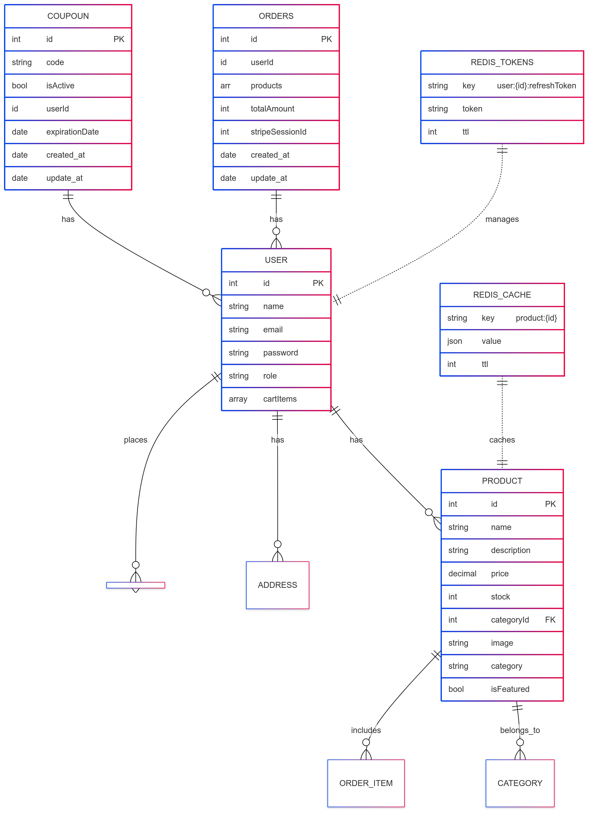

# E-commerce Store API

A robust and scalable E-commerce REST API built with Node.js, Express, MongoDB, and Redis. This API provides comprehensive functionality for managing products, user authentication, shopping cart operations, coupon management, and payment processing using Stripe.

## 🚀 Features

- **Authentication & Authorization**

  - User signup and login
  - JWT-based authentication with access and refresh tokens
  - Role-based access control (Admin/Customer)
  - Secure password hashing using bcrypt

- **Product Management**

  - CRUD operations for products
  - Featured products listing
  - Product categorization
  - Product recommendations
  - Image upload using Cloudinary

- **Shopping Cart**

  - Add/Remove products
  - Update quantities
  - Cart persistence

- **Coupon System**

  - Dynamic coupon generation
  - Coupon validation
  - Expiration date management
  - User-specific coupons

- **Payment Processing**

  - Secure checkout using Stripe
  - Order management
  - Payment status tracking

- **Performance Optimization**
  - Redis caching for featured products
  - Efficient database queries
  - Response optimization

## 🛠️ Tech Stack

- **Backend**: Node.js, Express.js
- **Database**: MongoDB with Mongoose ODM
- **Caching**: Redis
- **Authentication**: JWT (JSON Web Tokens)
- **Payment**: Stripe API
- **Image Storage**: Cloudinary
- **API Documentation**: Swagger/OpenAPI
- **Others**: Cookie-parser, CORS

## 📐 System Architecture

### Database Schema



Our database design implements a robust schema with the following key entities:

- **User**: Central entity managing authentication and user data
- **Product**: Comprehensive product information with category relationships
- **Order**: Transaction management with user associations
- **Coupon**: Promotional code management system
- **Redis Tokens**: JWT token management for authentication
- **Redis Cache**: Product caching implementation

### User Flow Diagram


The application supports two main user roles:

- **Customer Journey**:

  - Browse Product Catalog
  - View Product Details
  - Shopping Cart Management
  - Order Processing
  - Payment Gateway Integration
  - Order Confirmation
  - Email Notifications

- **Admin Capabilities**:
  - Product Management
  - Category Management
  - Order Overview
  - User Management

### Caching Strategy


Implementation of an efficient caching system using Redis:

1. **Product Request Flow**:
   - Check Redis cache first
   - Fallback to database if cache miss
   - Automatic cache population
2. **Product Update Flow**:
   - Direct database update
   - Cache invalidation
   - Selective cache refresh

### Authentication Flow


Secure JWT-based authentication system:

- Token refresh mechanism
- Access token management
- Logout handling with token blacklisting

### Login Sequence


Detailed authentication process:

1. User credentials verification
2. Token generation and storage
3. Redis-based token management
4. Subsequent request handling
5. Token refresh mechanism

## 🔐 Security Implementation

The application implements several security measures:

- JWT-based authentication with refresh tokens
- Redis-based token blacklisting
- Secure password hashing
- Role-based access control
- Input validation and sanitization

## 💾 Caching Strategy

The application uses Redis for two primary purposes:

1. **Token Management**:

   - Refresh token storage
   - Token blacklisting
   - Session management

2. **Product Caching**:
   - Frequently accessed products
   - Category-based caching
   - Automatic cache invalidation

## 📦 Installation

1. Clone the repository:

```bash
git clone (https://github.com/Anas-Shalaby/E-commerece-NodeJs)
cd E-commerece-NodeJs
```
